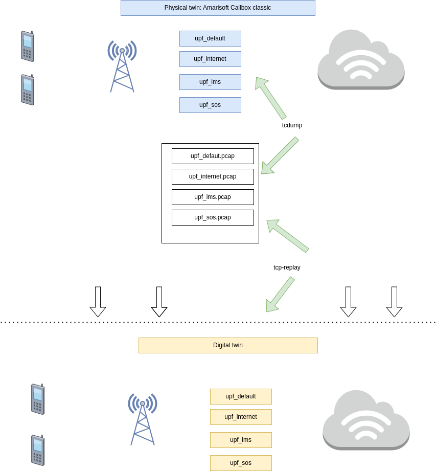

# Amarisoft digital twin 
Based on the already existing [5G network emulator](https://github.com/fabrizio-granelli/comnetsemu_5Gnet), with an added new functionality:
**Implementation of a command line interaction for automatic user creation.** 

## Prerequisites

Tested Versions:
- Comnetsemu: v0.3.0 (Installed following either "Option 1" or "Option 3" from [here](https://git.comnets.net/public-repo/comnetsemu) )
- UERANSIM: v3.2.6
- Open5gs: v2.4.2

Necessary Python packages:
- pymongo
- json
- pyyaml

## Build Instructions

1. Clone repository in the comnetsemu VM, into ~/comnetsemu/app folder.
```
cd ~/comnetsemu/app 
git clone https://github.com/TatendaHZ/5G-Digital-twin.git
```
**Note:** make sure variables **prj_folder** and **mongodb_folder** (lines 22 and 23 of the example script) are correct. They may change depending on your installation method or original repository.

2. Download the necessary docker images:

```
cd build
./dockerhub_pull.sh
```


## Run automatic slice creation simulator

### Our topology
The topology is very similar to the one in the original repository. Basically each of the elements in our network runs in a separate Docker host.

This means that we will have 3 basic hosts (UE, gNB and CP), plus one additional host per slice (UPF).
A PDU session will be initiated for each slice.
The current configuration links all UPF docker hosts to the second switch (S2). 

</img>


Build the server docker image:

```
cd 5G_Project-auto-users/video_server
./build.sh
```
## Run the data acquisition code

```
sudo python3 twin_data_collector.py
```

## Run the network topology

```
sudo python3 modified.digital_twin_setup.py
```

## Run digital twin

```
./runDigitaltwin.sh

```

## Traffic capture and  tests


```
sudo python3 5G.Net.test.py
```


### Contact

Amarisoft digital-twin creation: 
- Tatenda Horiro Zhou - tatendazho@gmail.com

Supervised by: 
- Fabrizio Granelli - fabrizio.granelli@unitn.it


# 5G-Digital-twin
